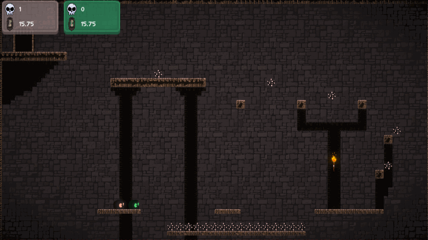

+++
title = "Super Fuzzball"
date = 2020-02-02T04:14:54-08:00
+++

A 2D platformer with a grappling hook mechanic — the main focus of this project was learning how to use the new Unity input system and how to create tight platformer controls using unity's physics. Works well in single player, but gets much more chaotic fun with more players. Supports as many controllers as you can plug in[*](#challenges).

## Objective

This project's aim was to have a complete game loop featuring local multiplayer and learning to use [Unity's new input system](https://docs.unity3d.com/Packages/com.unity.inputsystem@1.4/manual/index.html), which had just became available as a beta around the same time.

## Mechanics & Concepts

* New Input System supporting any amount of players[*](#challenges)
* Tight platforming controls with wall jumps
* Grappling hook mechanic
* Storing scores on a per-level basis (Deaths and Times)
* Exploring Unity Tilemaps


    

    

    {{< rightimagetextbox `Fuzzball Grappling` `The grappling hook is physics based, it shoots out a small Rigidbody2D with a line renderer drawing a line between itself and the player. If it hits normal terrain, it'll give the player a small momentum boost in the opposite direction. If it hits another player, it'll gently nudge that player, and if it hits an attachable object, it'll attach and switch the player's normal movement controller to a grappled controller that handles circular motion around the anchor, as well as shortening and lengthening the hook distance.` "fuzzball-grapple_854x480.webp" "Fuzzball grappling">}}

    


## Challenges

* [*](#mechanics--concepts)The screen can only fit about 7-8 score plates, any others will just be cut off
* The main menu UI only supports mouse input
* Once a player has joined with an input device, they cannot be removed
* If the player dies while grappled, the respawned character remains attached to the grapple point
